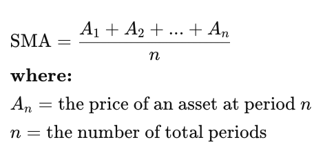
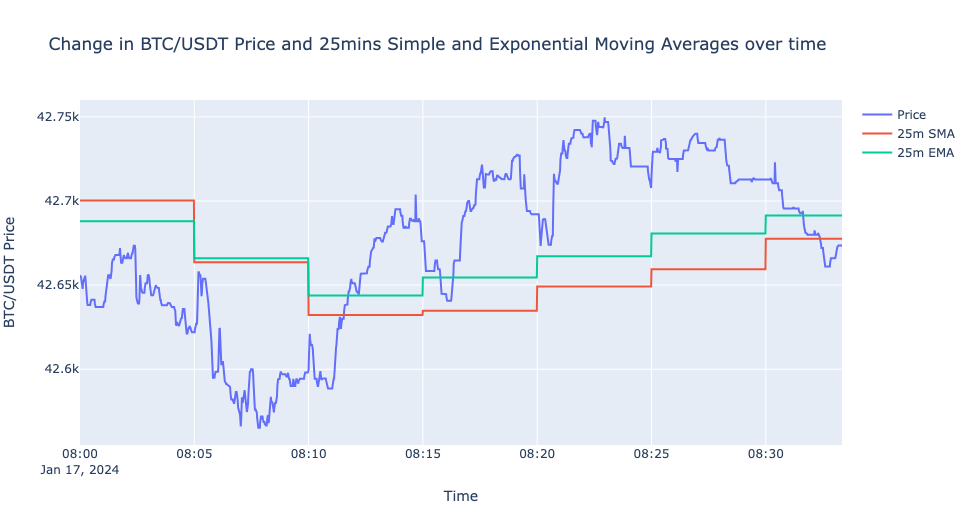

<div align="center">
  <h3>Short-term Crossover Tracking with BTC/USDT</h3>
  <p>Identifying trends using SMA crossovers on real-time BTC/USDT prices</p>
</div>

## About The Project
* This project aims to gain insights into market dynamics by using Simple Moving Average (SMA) as a technical indicator to predict future price trends
* By comparing SMA and the current mid-price, we look for `crossovers` which might signal potential momentum or market sentiment as the price rises above or falls below the short-term average
* We are also able to access the liquidity of the market and overall ease for traders to enter and exit positions by accessing the bid-ask spread

##### Real-time BTC/USDT price data from Binance
* [KLine/Candlestick Stream](https://binance-docs.github.io/apidocs/spot/en/#kline-candlestick-streams)
* [Partial Book Depth Stream](https://binance-docs.github.io/apidocs/spot/en/#partial-book-depth-streams)

##### Technical Implementation
* Real-time, low latency `WebSocket` communication is used to consume highly-frequent market data from Binance, whilst minimising overhead when maintaining the persistent connection
* Data is instaneously processed and written into csv files for further post-analysis
* The closing price from the 1min KLine stream data is used to calculate the SMA using a 5mins timeframe
* The mid price is calculated by taking the average of the best bid and the best ask price from the Partial Book

* Crossover Indicator
  * `OVER`: Mid price rises above the SMA
  * `UNDER`: Mid price falls below the SMA
  * `NEUTRAL`: Mid price is equal to the SMA

### What is Simple Moving Average (SMA)
* It is a calculation that represents the average over a set of prices within a certain timeframe
* It can act as a technical indicator that can aid in determining if an asset price will continue in its current trend and direction or not
* It smoothens out short-term price fluctuations and highlights the general direction of the trend

<div>
  
</div>

[Learn more](https://www.investopedia.com/terms/s/sma.asp)

## Built With
* [Python](https://www.python.org/doc/)
* [Tornado](https://www.tornadoweb.org/en/stable/guide.html)

## Getting Started
1. Install dependencies required
   `pip install -r requirements.txt`
2. Run the application
   ```
   cd app
   python main.py
   ```
3. WebSocket handlers
   ```
   ws://127.0.0.1:8888/binance-klines
   ws://127.0.0.1:8888/binance-partial-book
   ```

## Results
| Timestamp | Mid Price | 5mins SMA | Spread | Crossover |
| ----- | ----- | ----- | ----- | ----- |
| 2024-01-14 13:37:05 | 42816.005000000005 | 42815.39399999999 | 0.010000000002037268 | Over |
|2024-01-14 13:37:06 | 42815.5 | 42815.39399999999 | -1.0 | Over |
| 2024-01-14 13:37:07 | 42814.994999999995 | 42815.39399999999 | 0.010000000002037268 | Under |
> Instance of mid price dipping below 5mins SMA as orders get fulfilled
* This could potentially signal a downward momentum as price falls below historical average

<div>
  
</div>

> Line graph from sample binance partial book data

## Improvements
#### Considering other timeframes
* Shorter timeframes can react more quickly to price changes
* Longer timeframes can provide a smoother trend indication but may lag in responding to rapid price movements

#### Other technical indicators for crossovers
* Exponential Moving Average (EMA) is another technical indicator that gives more weight to recent prices, making it more responsive to recent market changes
* This might be more suitable for traders focused on short-term movements as EMA reacts more quickly to changes in price

#### Likelihood of false signals
* False signals can be more prevalent in choppioer markets and additional indicators and filters should be used to reduce the liklihood of acting on false signals