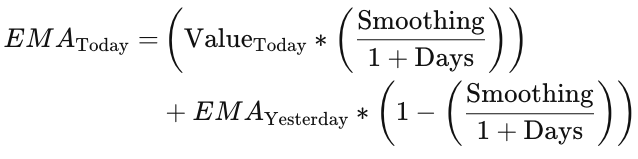

<div align="center">
  <h3>Short-term Crossover Tracking with BTC/USDT</h3>
  <p>Identifying trends using Moving Average crossovers on real-time BTC/USDT prices</p>
</div>

## About The Project
* This project aims to gain insights into market dynamics by using Simple Moving Average (SMA) and Exponential Moving Average (EMA) over different timeframes as technical indicators to predict future price trends
* By comparing the Moving Averages and the current mid-price, instances where the price rises above or falls below the Moving Averages - `crossovers`, might signal potential momentum or market sentiment
* Instances where the short-term moving average crosses the long-term moving average like `The Golden Cross` or `The Death Cross` also signals a bullish/bearish breakout pattern
* From the partial order book, we are also able to access the liquidity of the market and overall ease for traders to enter and exit positions by calculating the bid-ask spread

##### Real-time BTC/USDT price data from Binance
* [KLine/Candlestick Stream](https://binance-docs.github.io/apidocs/spot/en/#kline-candlestick-streams)
* [Partial Book Depth Stream](https://binance-docs.github.io/apidocs/spot/en/#partial-book-depth-streams)

##### Technical Implementation
* Real-time, low latency `WebSocket` communication is used to consume highly-frequent market data from Binance, whilst minimising overhead when maintaining the persistent connection
* Data is instaneously processed and written into csv files for further post-analysis
* The closing price from the 1min KLine stream data is used to calculate the 5mins Moving Averages while the closing price from the 5min KLine stream data is used to calculate the 25mins Moving Averages
* The mid price is calculated by taking the average of the best bid and the best ask price from the Partial Book

* Crossover Indicator
  * `OVER`: Mid price rises above the SMA
  * `UNDER`: Mid price falls below the SMA
  * `NEUTRAL`: Mid price is equal to the SMA

#### What is Simple Moving Average (SMA)
* It is a calculation that represents the average over a set of prices within a certain timeframe
* It can act as a technical indicator that can aid in determining if an asset price will continue in its current trend and direction or not
* It smoothens out short-term price fluctuations and highlights the general direction of the trend

<div>
  
</div>

[Learn more](https://www.investopedia.com/terms/s/sma.asp)

#### What is Exponential Moving Average (SMA)
* It is another type of moving average calculation
* Compared to SMA, EMA gives more weight to recent prices, making it more responsive to recent market changes
* This might be more suitable for traders focused on short-term movements as EMA reacts more quickly to changes in price

<div>
  
</div>

[Learn more](https://www.investopedia.com/terms/e/ema.asp)

### Built With
* [Python](https://www.python.org/doc/)
* [Tornado](https://www.tornadoweb.org/en/stable/guide.html)

#### Getting Started
1. Install dependencies required
   `pip install -r requirements.txt`
2. Run the application
   ```
   cd app
   python main.py
   ```
3. WebSocket handlers
   ```
   ws://127.0.0.1:8888/binance-short-kline
   ws://127.0.0.1:8888/binance-long-kline
   ws://127.0.0.1:8888/binance-partial-book
   ```

### Results
| Timestamp | Mid Price | 5mins SMA | 5mins EMA | 25mins SMA | 25mins EMA |
| ----- | ----- | ----- | ----- | ----- | ----- |
| 2024-01-17 08:09:34 | 42592.9 | 42592.90400000001 | 42597.01009266221 | 42663.566000000006 | 42665.98251851853 |
| 2024-01-17 08:09:35 | 42594.295 | 42592.90400000001 | 42597.01009266221 | 42663.566000000006 | 42665.98251851853 |
> Instance of mid price rising above 5mins SMA, potentially signal an upward momentum as price rises above the "historical average"

<div>
  
</div>

> Comparing 25mins Simple Moving Average and 25mins Exponential Moving Average
* EMA reacts faster to price changes than SMA

<div>
  
</div>

> Comparing 5mins and 25mins Simple Moving Average
* Shorter timeframes can react more quickly to price changes
* Longer timeframes can provide a smoother trend indication but may lag in responding to rapid price movements

### Improvements
#### Likelihood of false signals
* False signals can be more prevalent in choppioer markets and additional indicators and filters should be used to reduce the liklihood of acting on false signals
